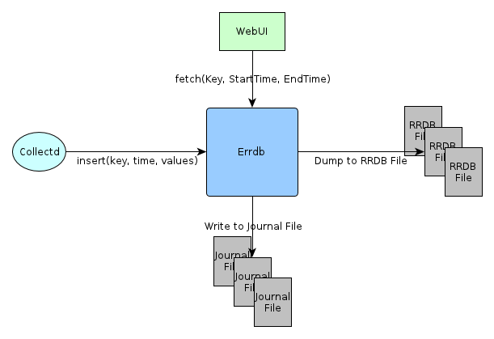

# 什么是Errdb

Errdb(Extensible Round Robin Database)是可扩展的环形的数据库，用于存储储时间序列性能指标数据。

# Errdb架构

Errdb采用内存+文件的方式存储最近一段时间(T0~Tn)之间的指标数据，概念模型：

-------------------------------------------------------------------
> -----------------------------------------------------------------
>	  | 			Memory			|			Disk			|		
>	  |	Tn | Tn-1 | Tn-2 | Tn-3 |...| Tm | Tm-1 | Tm-2 |...| T0 |
>     |----|------|------|------|---|----|------|------|---|----|
> key1| Vn | Vn-1 | Vn-2 | Vn-3 |...| Vm | Vm-1 | Vm-2 |...| V0 |
> key2|...........................................................
-------------------------------------------------------------------

Errdb实现上每个Key对应一个Round Robbin的存储文件，时间序列的性能数据先写入
内存，然后定期DUMP到文件。

实现模型如下：

# Errdb应用

Errdb在WLAN网管用于存储原始的性能数据，一般存储最近两天，WLAN网管界面上的所有
实时性能图表，都来自ERRDB。

Errdb生成的Journal文件在WLAN网管中，会通过定时任务导入到Oracle进行聚合归并生成
报表数据。

# Errdb启动停止

Errdb安装目录下有start, stop, status三个脚本：

1. start 启动Errdb进程
2. status 查询Errdb状态
3. stop 停止Errdb进程

# Errdb文件存储

Errdb缺省情况下把数据文件存储在var/rrdb/目录, journal文件存储在var/journal/目录。

通过etc/errdb.config配置文件，可重设相关存储目录。

# Errdb设计参考

[Redis]: http://redis.io
[RRDTOOL]: http://oss.oetiker.ch/rrdtool/
[Cassandra]: http://cassandra.apache.org/
[Mongodb]: http://www.mongodb.org/

